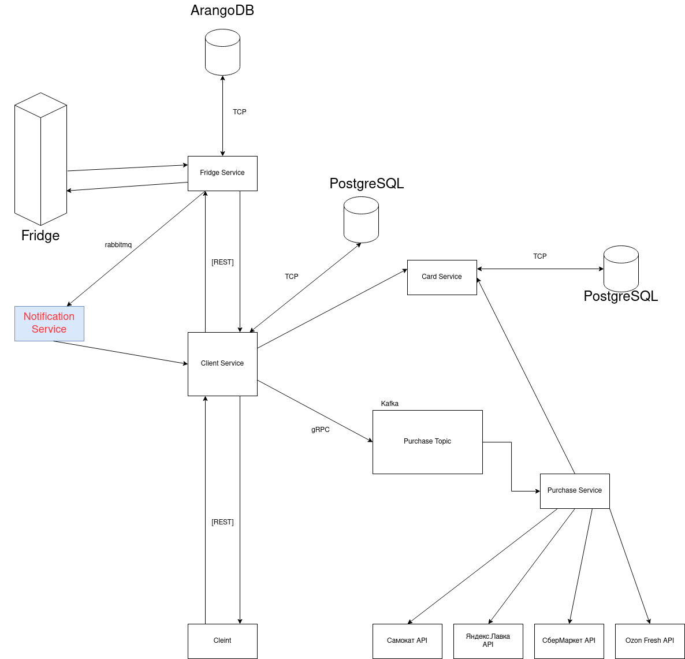
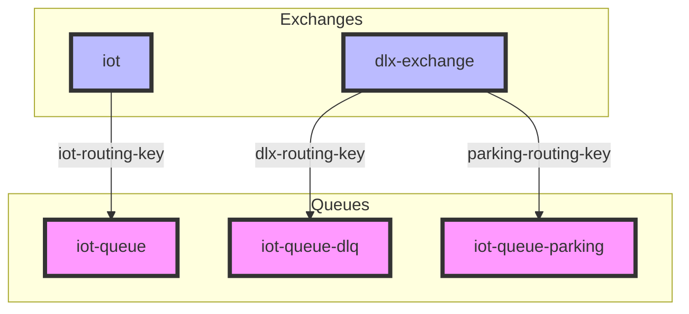

# Сервис уведомлений (notification-service)

## Общая схема проекта

## Диаграмма RabbitMq

```mermaid
graph TD;
    subgraph Queues
        A[iot-queue]
        B[iot-queue-dlq]
        C[iot-queue-parking]
    end

    subgraph Exchanges
        D[iot]
        E[dlx-exchange]
    end

    D -->|iot-routing-key| A
    E -->|dlx-routing-key| B
    E -->|parking-routing-key| C

    classDef queue fill:#f9f,stroke:#333,stroke-width:4px;
    classDef exchange fill:#bbf,stroke:#333,stroke-width:4px;

    class A,B,C queue;
    class D,E exchange;
```